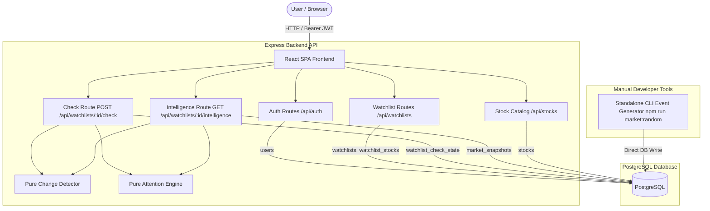

# Smart Market Watchlist — System Architecture

The Smart Market Watchlist is a financial market monitoring system designed around a single guiding principle:

$$\text{Remember} \longrightarrow \text{Compare} \longrightarrow \text{Understand} \longrightarrow \text{Prioritize}$$

Instead of overwhelming investors with endless streams of raw ticks and complex charts, Market Watch remembers when a user last checked their watchlist, evaluates subsequent market observations against that established personal baseline, and prioritizes actionable developments into clean attention tiers.

---

## 1. System Overview

The system architecture cleanly separates user watchlists, checkpoint state tracking, pure change detection, and market observation storage:

```
React Frontend (Vite + TypeScript)
       │ (JSON over HTTP + Bearer JWT)
       ▼
REST API Layer (Express.js)
       │
       ├── Authentication & Authorization (JWT + bcryptjs)
       ├── Watchlist Management (Scoping & CRUD)
       ├── Checkpoint Watermarking ("Since You Last Checked")
       └── Intelligence Aggregation (Live Quotes + Attention Status)
       │
       ▼
Domain & Evaluation Services
       ├── Change Detection Engine (Pure Mathematical Analysis)
       └── Attention Engine (Prioritization & Plain-English Explanations)
       │
       ▼
PostgreSQL Relational Storage (Single Source of Truth)
       ├── users
       ├── watchlists
       ├── stocks
       ├── watchlist_stocks
       ├── market_snapshots
       └── watchlist_check_state
```

### Architectural Principles
- **Separation of Market Data from Watchlists**: Market snapshots represent global instrument observations independent of which users or watchlists track them.
- **Checkpoint-Driven State**: The system does not store millions of redundant per-user event rows. Instead, each watchlist maintains a lightweight watermark (`last_checked_at`, `last_checked_market_time`) in `watchlist_check_state`, allowing the engine to calculate deltas on demand.
- **Deterministic Simulation / Controlled Testing**: For demonstration and local verification, the system uses a deterministic simulator and a standalone CLI chaos generator rather than live stock-market API connections. This ensures repeatable, auditable tests for evaluating boundary conditions and threshold triggers.

---

## 2. Technology Stack

### Frontend
- **Framework**: React 18 (Single Page Application)
- **Language**: TypeScript (Strict Mode)
- **Build Tooling**: Vite 5
- **Styling**: Vanilla CSS (Modular design tokens, responsive cards, dark theme)

### Backend
- **Runtime**: Node.js (v20+)
- **Web Framework**: Express.js 4 (ESM modules)
- **Language**: TypeScript (Strict compilation to ES2022 / NodeNext)
- **Database Driver**: `pg` (Node-Postgres connection pooling)
- **Authentication**: `jsonwebtoken` (HMAC SHA-256 JWT tokens) & `bcryptjs` (Password hashing with 10 salt rounds)

### Database
- **Database Engine**: PostgreSQL 14+ (Relational storage with relational integrity, foreign key cascades, and check constraints)

### Testing & Verification
- **Test Framework**: Vitest
- **HTTP Assertion**: Supertest
- **Mock PostgreSQL**: `pg-mem` (In-memory SQL unit testing for isolated route and model tests)

> [!NOTE]
> **Explicit Architectural Boundaries**: Redis, Kafka, Redpanda, Docker, WebSockets, background cron workers, and client-side polling loops are **NOT** part of this system. All calculations are executed synchronously on-demand via standard HTTP transactions against PostgreSQL.

---

## 3. High-Level Component Diagram



---

## 4. Repository Structure

```
market-watchlist/
├── backend/
│   ├── src/
│   │   ├── app.ts                 # Express application factory, middleware, and route mounting
│   │   ├── server.ts              # Server bootstrap and graceful shutdown handler
│   │   ├── config.ts              # Type-safe environment configuration loader
│   │   ├── auth/
│   │   │   ├── jwt.ts             # JWT token signing and verification utilities
│   │   │   └── passwords.ts       # Bcrypt password hashing and verification
│   │   ├── infrastructure/
│   │   │   ├── postgres.ts        # PostgreSQL pool manager, health checker, and lifecycle
│   │   │   ├── schema.sql         # Idempotent DDL schema definition with constraints & indexes
│   │   │   ├── init-db.ts         # Database initializer and default development user seeder
│   │   │   └── inspect-db.ts      # Live CLI database state inspection utility
│   │   ├── market/
│   │   │   ├── attention-engine.ts# Pure rule-based attention level and reason classifier
│   │   │   ├── change-detector.ts # Pure mathematical price and volume change detector
│   │   │   ├── market-data.ts     # Snapshot persistence and latest observation query functions
│   │   │   ├── market-feed.ts     # Internal simulated snapshot persistence service
│   │   │   └── market-simulator.ts# Deterministic scenario generator (STABLE, PRICE_MOVE, VOLUME_SPIKE)
│   │   ├── middleware/
│   │   │   └── auth.middleware.ts # Express requireAuth middleware validating Bearer tokens
│   │   ├── routes/
│   │   │   ├── auth.routes.ts     # Register, login, and session identity (/api/auth)
│   │   │   ├── watchlist.routes.ts# Watchlist CRUD and stock membership endpoints
│   │   │   ├── check.routes.ts    # Core "Since You Last Checked" checkpoint logic
│   │   │   ├── intelligence.routes.ts # Summary counts and live market quotes
│   │   │   ├── market.routes.ts   # Stock catalog search and latest market data lookup
│   │   │   ├── change.routes.ts   # Pairwise stock snapshot comparison endpoint
│   │   │   ├── simulation.routes.ts # Development-only simulation endpoint (POST /api/market/simulate)
│   │   │   └── health.routes.ts   # System and database liveness endpoint (GET /health)
│   │   └── tools/
│   │       └── market-chaos.ts    # Standalone CLI market observation generator (market:random)
│   └── tests/                     # 14 Vitest test suites (160 automated tests)
├── frontend/
│   ├── src/
│   │   ├── main.tsx               # Application root entry point
│   │   ├── App.tsx                # Dual-state dashboard layout and reconciliation logic
│   │   ├── App.css                # Component styling, animations, and responsive layout
│   │   ├── index.css              # Global resets, typography, and color tokens
│   │   ├── api.ts                 # Centralized typed API client with session management
│   │   ├── vite-env.d.ts          # Vite client and environment type definitions
│   │   └── components/
│   │       ├── AuthScreen.tsx     # Sign in, create account, and demo login UI
│   │       ├── AddStocksModal.tsx # Stock catalog search, addition, and removal modal
│   │       ├── CreateWatchlistModal.tsx # Modal dialog for creating new watchlists
│   │       └── DeleteWatchlistModal.tsx # Confirmation dialog for watchlist deletion
│   ├── index.html                 # HTML shell
│   └── vite.config.ts             # Vite server and proxy configuration
├── shared/
│   └── contracts/
│       └── README.md              # Shared data contracts and architectural boundaries
├── docs/
│   ├── ARCHITECTURE.md            # Complete system architecture documentation (this document)
│   └── SETUP_AND_RUN.md           # Developer local setup, run, and demo guide
├── package.json                   # Monorepo workspaces definition and root commands
└── README.md                      # High-level project overview
```

---

## 5. Database Architecture

The PostgreSQL schema consists of 6 tables with relational constraints, foreign keys, and indexes:

```
┌──────────────┐       ┌────────────────┐       ┌──────────────────┐
│    users     │ ──<   │   watchlists   │ ──<   │ watchlist_stocks │
└──────────────┘       └────────────────┘       └──────────────────┘
                              │                          │
                              │ 1:1                      │
                              ▼                          ▼
                       ┌──────────────────────┐ ┌──────────────────┐
                       │watchlist_check_state │ │      stocks      │
                       └──────────────────────┘ └──────────────────┘
                                                         │
                                                         │ 1:N
                                                         ▼
                                                ┌──────────────────┐
                                                │ market_snapshots │
                                                └──────────────────┘
```

### Table Definitions

#### 1. `users`
- **Purpose**: Stores user identities and credentials.
- **Columns**: `id` (BIGSERIAL PK), `email` (VARCHAR(255) UNIQUE), `password_hash` (TEXT), `created_at` (TIMESTAMPTZ).
- **Constraints**: Enforces unique email addresses.

#### 2. `watchlists`
- **Purpose**: Represents named watchlists created by authenticated users.
- **Columns**: `id` (BIGSERIAL PK), `user_id` (BIGINT FK REFERENCES users(id) ON DELETE CASCADE), `name` (VARCHAR(100)), `created_at` (TIMESTAMPTZ), `updated_at` (TIMESTAMPTZ).
- **Indexes**: `idx_watchlists_user_id` on `user_id` for fast user-specific lookups.

#### 3. `stocks`
- **Purpose**: Global catalog of financial instruments.
- **Columns**: `id` (BIGSERIAL PK), `symbol` (VARCHAR(20)), `company_name` (VARCHAR(200)), `exchange` (VARCHAR(20)), `created_at` (TIMESTAMPTZ).
- **Constraints**: `UNIQUE(symbol, exchange)`.

#### 4. `watchlist_stocks`
- **Purpose**: Many-to-many join table mapping stocks to watchlists.
- **Columns**: `watchlist_id` (BIGINT FK REFERENCES watchlists(id) ON DELETE CASCADE), `stock_id` (BIGINT FK REFERENCES stocks(id) ON DELETE CASCADE), `added_at` (TIMESTAMPTZ).
- **Primary Key**: Composite `(watchlist_id, stock_id)`.
- **Indexes**: `idx_watchlist_stocks_stock_id` on `stock_id`.
- **Special Significance**: `added_at` is crucial for the "Since You Last Checked" baseline rule for newly added stocks.

#### 5. `market_snapshots`
- **Purpose**: Append-only time-series observations of market data.
- **Columns**: `id` (BIGSERIAL PK), `stock_id` (BIGINT FK REFERENCES stocks(id) ON DELETE CASCADE), `price` (NUMERIC(12,2)), `open_price` (NUMERIC(12,2)), `high_price` (NUMERIC(12,2)), `low_price` (NUMERIC(12,2)), `previous_close` (NUMERIC(12,2)), `volume` (BIGINT), `market_time` (TIMESTAMPTZ), `created_at` (TIMESTAMPTZ).
- **Constraints**: `CHECK (price > 0 AND open_price > 0 AND high_price > 0 AND low_price > 0 AND previous_close > 0)`, `CHECK (volume >= 0)`, `CHECK (high_price >= low_price)`.
- **Indexes**: Composite `idx_market_snapshots_stock_time ON market_snapshots(stock_id, market_time DESC)`.

#### 6. `watchlist_check_state`
- **Purpose**: Tracks checkpoint watermarks per watchlist.
- **Columns**: `watchlist_id` (BIGINT PK REFERENCES watchlists(id) ON DELETE CASCADE), `last_checked_at` (TIMESTAMPTZ), `last_checked_market_time` (TIMESTAMPTZ), `updated_at` (TIMESTAMPTZ).

---

## 6. Market Data Model & Timestamp Semantics

A critical distinction in the market data architecture is the separation between observation time and storage time:

- **`market_time`** ($\text{Observation Timestamp}$): The effective market timestamp associated with the financial quote (e.g. simulated trading tick time). All change detection comparisons and checkpoint watermarks evaluate strictly against `market_time`.
- **`created_at`** ($\text{System Ingestion Timestamp}$): The exact database persistence timestamp (`DEFAULT NOW()`).

```
           Snapshot #1                             Snapshot #2
   market_time = 09:15:00                  market_time = 09:30:00
   created_at  = 14:00:01                  created_at  = 14:05:22
        │                                       │
        └──────────── Price Movement Δ ─────────┘
                      Evaluated strictly on
                      market_time progression
```

This separation allows historical data replay, backfill simulation, and offline demonstration without corrupting market chronology.

---

## 7. Market Simulation & Event Generation

The system supports two complementary simulation mechanisms for demonstration and automated testing:

### 1. Embedded Scenario Simulator (`market-simulator.ts`)
Generates mathematically valid, deterministic OHLC snapshots:
- `STABLE`: Tight price variation ($\pm 0.3\%$) with normal volume ($\sim 100\text{K}$).
- `PRICE_MOVE`: Significant upward price movement ($+3.5\%$ to $+5.0\%$) with moderate volume.
- `VOLUME_SPIKE`: High volume ($1.5\text{M}$ to $3.0\text{M}$, $\ge 15\times$) with small price variation ($< 0.5\%$).

### 2. Standalone Manual Chaos Generator (`backend/src/tools/market-chaos.ts`)
A dedicated developer CLI utility invoked via:
```bash
npm run market:random -- <symbol> <event-type>
```

Supported event types:
- `stable`: Small price fluctuations ($\pm 0.1\%$ to $\pm 0.5\%$) $\rightarrow$ expected `NO_MEANINGFUL_CHANGE`.
- `price-up`: Bullish breakout ($+3.5\%$ to $+6.0\%$) $\rightarrow$ expected `NEEDS_ATTENTION`.
- `price-down`: Bearish selloff ($-3.5\%$ to $-6.0\%$) $\rightarrow$ expected `NEEDS_ATTENTION`.
- `volume-spike`: Institutional surge ($2.1\times$ to $3.5\times$) $\rightarrow$ expected `WORTH_WATCHING`.
- `price-and-volume`: High-conviction momentum ($+3.5\%$ to $+6.0\%$ price and $2.0\times+$ volume) $\rightarrow$ expected `NEEDS_ATTENTION`.

> [!IMPORTANT]
> The chaos generator is **manually triggered** via the terminal. There are no background timers, automatic intervals, or WebSocket broadcasts. A generated event is written to `market_snapshots` in PostgreSQL and remains pending until the user explicitly clicks **"Check for Changes"**.

---

## 8. Pure Change Detection Engine

The change detector (`change-detector.ts`) is a pure function:
$$\text{detectMarketChange}(\text{previousSnapshot}, \text{currentSnapshot}) \longrightarrow \text{MarketEvent}$$

### Mathematical Formulas
1. **Price Change Percentage**:
   $$\Delta P\% = \left(\frac{P_{\text{current}} - P_{\text{previous}}}{P_{\text{previous}}}\right) \times 100$$
2. **Volume Multiplier & Change Percentage**:
   $$\Delta V\% = \left(\frac{V_{\text{current}} - V_{\text{previous}}}{V_{\text{previous}}}\right) \times 100 \quad (\text{when } V_{\text{previous}} > 0)$$

### Significance Thresholds
- **Significant Price Movement**: $|\Delta P\%| \ge 3.0\%$ (unrounded evaluation prevents floating-point boundary truncation).
- **Volume Spike**: $V_{\text{current}} \ge 2 \times V_{\text{previous}}$ ($200\%$ of baseline volume).
- **Zero-Volume Edge Case**: When $V_{\text{previous}} = 0$, `volumeChangePercent` is `null` and `significantVolume` is `false` to prevent division-by-zero errors.

### Event Classification Matrix

| Significant Price ($|\Delta P\%| \ge 3\%$) | Volume Spike ($V_{\text{curr}} \ge 2 \times V_{\text{prev}}$) | Event Type | Severity |
| :---: | :---: | :--- | :--- |
| **Yes** | **Yes** | `PRICE_AND_VOLUME` | `SIGNIFICANT` |
| **Yes** | **No** | `PRICE_MOVEMENT` | `SIGNIFICANT` |
| **No** | **Yes** | `VOLUME_SPIKE` | `WATCH` |
| **No** | **No** | `NO_SIGNIFICANT_CHANGE` | `INFO` |

*Note: Both positive ($+5.6\%$) and negative ($-4.8\%$) price moves trigger `SIGNIFICANT` because the engine evaluates absolute percentage magnitude $|\Delta P\%|$; directional indicators are preserved for frontend display.*

---

## 9. "Since You Last Checked" Checkpoint Semantics

### Conceptual Model: Checkpoint vs Watermark
- **`last_checked_at`**: The wall-clock application timestamp when the user clicked "Check for Changes".
- **`last_checked_market_time`**: The highest `market_time` among all snapshots evaluated during that check.

```
Timeline: ────────[Baseline Snapshot]───────(Last Check)───────[New Snapshot]───────(Current Check)───>
                    ▲                                              ▲
                    │                                              │
           last_checked_market_time                       new market watermark
```

### Execution Rules

#### Rule 1: First Check (Baseline Initialization)
When checking a watchlist for the first time (`watchlist_check_state` does not exist):
1. Finds the latest `market_time` among available snapshots for stocks in the watchlist.
2. Inserts initial row into `watchlist_check_state` with `last_checked_market_time = maxMarketTime`.
3. Returns `changes: []` and `previouslyCheckedAt: null`.
4. *Result: Establishes baseline without falsely reporting historical changes as new alerts.*

#### Rule 2: Subsequent Check (Change Evaluation)
1. Acquires row-level lock on `watchlist_check_state WHERE watchlist_id = $1 FOR UPDATE` inside a database transaction (`BEGIN ... COMMIT`).
2. For each stock in the watchlist:
   - Queries baseline snapshot ($\le \text{last\_checked\_market\_time}$).
   - Queries latest snapshot overall.
   - If latest snapshot is newer than baseline, runs `detectMarketChange`.
   - Filters out `NO_SIGNIFICANT_CHANGE`, keeping only `SIGNIFICANT` and `WATCH` events.
3. Advances `last_checked_market_time` to the maximum observed `market_time`.
4. Commits transaction and returns detected `changes`.

#### Rule 3: Newly Added Stock Rule
If a stock was added after the previous check (`added_at > last_checked_market_time`):
- Its baseline snapshot is the **first observation at or after `added_at`** (`ORDER BY market_time ASC LIMIT 1`).
- *Result: Prevents older movements that occurred before the stock joined the watchlist from appearing as new alerts.*

#### Rule 4: Transaction Concurrency & Failure Safety
If any query fails during check processing, the transaction executes `ROLLBACK`. The checkpoint watermark remains unchanged, guaranteeing that market events are never dropped or skipped.

---

## 10. Pure Attention Engine

The attention engine (`attention-engine.ts`) translates raw market events into user-centric priority tiers:

$$\text{classifyAttention}(\text{MarketEvent}) \longrightarrow \text{AttentionResult } \{ \text{level}, \text{reason} \}$$

### Priority Hierarchy

```
┌─────────────────────────────────────────────────────────────┐
│ 🔴 NEEDS_ATTENTION                                          │
│    • Price movement >= 3.0%                                 │
│    • Price movement >= 3.0% combined with volume spike >= 2x│
├─────────────────────────────────────────────────────────────┤
│ 🟡 WORTH_WATCHING                                           │
│    • Volume spike >= 2x with price variation < 3.0%         │
├─────────────────────────────────────────────────────────────┤
│ 🟢 NO_MEANINGFUL_CHANGE / Stable                            │
│    • Normal market noise (< 3.0% price, < 2x volume)        │
│    • Unchecked baseline / initial snapshot                  │
└─────────────────────────────────────────────────────────────┘
```

### Classification Rules & Descriptions

1. **`PRICE_AND_VOLUME`**:
   - Level: `NEEDS_ATTENTION`
   - Reason: *"Significant price movement combined with a volume spike"*
2. **`PRICE_MOVEMENT` (Severity: `SIGNIFICANT`)**:
   - Level: `NEEDS_ATTENTION`
   - Reason: *"Significant price movement"*
3. **`VOLUME_SPIKE` (Severity: `WATCH`)**:
   - Level: `WORTH_WATCHING`
   - Reason: *"Unusual increase in trading volume"*
4. **`NO_SIGNIFICANT_CHANGE` (Severity: `INFO`)**:
   - Level: `NO_MEANINGFUL_CHANGE`
   - Reason: *"No significant market change detected"*
5. **No Previous Check Available** (Watchlist not yet checked):
   - Level: `NO_MEANINGFUL_CHANGE`
   - Reason: *"No previous check available"*

---

## 11. Watchlist Intelligence Endpoint

`GET /api/watchlists/:id/intelligence` is a **read-only** query endpoint that returns the complete current market view for a watchlist without advancing or altering the user's checkpoint.

### Structure of Intelligence Response
```json
{
  "watchlist": { "id": 6, "name": "Core Tech" },
  "summary": {
    "needsAttention": 1,
    "worthWatching": 0,
    "noMeaningfulChange": 3
  },
  "stocks": [
    {
      "stockId": 1,
      "symbol": "TCS",
      "companyName": "Tata Consultancy Services",
      "exchange": "NSE",
      "market": {
        "price": 3790.52,
        "previousClose": 3400.00,
        "changePercent": 11.49,
        "volume": 10643085,
        "marketTime": "2026-09-06T09:23:03.257Z"
      },
      "attention": {
        "level": "NEEDS_ATTENTION",
        "reason": "Significant price movement combined with a volume spike"
      }
    }
  ]
}
```

---

## 12. Authentication & Authorization Architecture

Authentication is stateless and token-based using standard JSON Web Tokens (JWT) and Bearer authorization:

```
Client                             Server                            PostgreSQL
  │                                  │                                   │
  ├─ POST /api/auth/register ───────>│ Hash password (bcrypt 10 rounds) ─┼─> INSERT INTO users
  │                                  │                                   │
  ├─ POST /api/auth/login ──────────>│ Verify password hash <────────────┼─> SELECT password_hash
  │<─ { token, user } ───────────────┤ Sign JWT { id, email }            │
  │                                  │                                   │
  ├─ GET /api/watchlists ───────────>│ requireAuth middleware            │
  │  (Authorization: Bearer <token>) │ Verify JWT signature & decode     │
  │                                  │ Query scoped to req.user.id ──────┼─> SELECT WHERE user_id = $1
```

### Multi-Tenant User Isolation
Every watchlist route enforces user isolation:
- `SELECT ... WHERE id = $1 AND user_id = $2`
- `UPDATE ... WHERE id = $1 AND user_id = $2`
- `DELETE ... WHERE id = $1 AND user_id = $2`

If User A attempts to access or delete User B's watchlist, the query returns 0 matching rows and the API responds with `404 Not Found`, preventing resource enumeration attacks.

---

## 13. REST API Catalog

| Method | Route | Auth | Request Body / Query | Success Status | Behavior / Response Description |
| :--- | :--- | :---: | :--- | :---: | :--- |
| `GET` | `/health` | No | None | `200 OK` | Reports backend service health and PostgreSQL connectivity (`status: 'ok' \| 'error'`). |
| `POST` | `/api/auth/register` | No | `{ email, password }` | `201 Created` | Validates email format and 8+ char password; hashes password; returns `{ user: { id, email } }`. |
| `POST` | `/api/auth/login` | No | `{ email, password }` | `200 OK` | Validates credentials; returns `{ user: { id, email }, token }`. |
| `GET` | `/api/auth/me` | Yes | Bearer JWT Header | `200 OK` | Decodes JWT and returns authenticated `{ user: { id, email } }`. |
| `GET` | `/api/watchlists` | Yes | Bearer JWT Header | `200 OK` | Returns array of watchlists owned by authenticated user. |
| `POST` | `/api/watchlists` | Yes | `{ name }` | `201 Created` | Creates a new user-owned watchlist. |
| `GET` | `/api/watchlists/:id` | Yes | Path parameter `:id` | `200 OK` | Returns watchlist metadata and member stock list. |
| `DELETE` | `/api/watchlists/:id` | Yes | Path parameter `:id` | `204 No Content` | Deletes watchlist, cascading memberships and check state. |
| `POST` | `/api/watchlists/:id/stocks` | Yes | `{ stockId }` | `201 Created` | Adds a stock to the specified user watchlist. |
| `DELETE` | `/api/watchlists/:id/stocks/:stockId` | Yes | Path `:id`, `:stockId` | `204 No Content` | Removes a stock from the watchlist. |
| `POST` | `/api/watchlists/:id/check` | Yes | Path parameter `:id` | `200 OK` | **Core Checkpoint**: Evaluates changes since baseline and advances watermark. |
| `GET` | `/api/watchlists/:id/intelligence` | Yes | Path parameter `:id` | `200 OK` | **Read-Only**: Returns current market snapshot, quotes, and attention states. |
| `GET` | `/api/stocks` | No | Optional `?q=search` | `200 OK` | Searches and lists global stock catalog. |
| `GET` | `/api/stocks/:stockId/market` | No | Path parameter `:stockId` | `200 OK` | Returns latest snapshot for a single instrument. |
| `GET` | `/api/stocks/:stockId/change` | No | Path parameter `:stockId` | `200 OK` | Compares the 2 latest snapshots of a stock. |
| `POST` | `/api/market/simulate` | Dev | `{ stockId, scenario }` | `201 Created` | *Development Only*: Generates simulated snapshot. Returns 404 in production. |

---

## 14. Frontend Dual-Source Architecture

A major challenge in stateful checkpoint systems is avoiding UI overwrite bugs:

```
               POST /api/watchlists/:id/check (Advances Checkpoint Watermark)
                               │
                               ▼
               setLatestCheckResult(checkResult)   <── Source of Truth for Attention Alerts
                               │
                               ▼
               GET /api/watchlists/:id/intelligence (Runs AFTER checkpoint advanced)
                               │
                               ▼
               setCurrentMarketData(intelligence)  <── Source of Truth for Live Prices
```

### The State Separation Pattern
1. **`currentMarketData`** (`GET /intelligence`): Responsible for live market prices, trading volumes, and catalog metadata.
2. **`latestCheckResult`** (`POST /check`): Responsible for alert classifications (`NEEDS_ATTENTION`, `WORTH_WATCHING`), price change percentages, and explanation text.

### Reconciled Display Mapping
In `App.tsx`, `displayStocks` joins both sources:
- **Attention Level & Reason**: Derived directly from `latestCheckResult.changes`.
- **Current Price & Volume**: Updated continuously from `currentMarketData`.

This guarantees that when the user clicks "Check for Changes", the alert cards (e.g. 🔴 HDFCBANK +5.69%) **remain visible** on screen even after subsequent background data fetches complete.

---

## 15. Complete User Journey

```mermaid
sequenceDiagram
    autonumber
    actor User
    participant UI as React Frontend
    participant API as Express Backend
    participant DB as PostgreSQL

    User->>UI: Sign In (email/password)
    UI->>API: POST /api/auth/login
    API-->>UI: { user, token }
    UI->>UI: Store token in localStorage
    
    UI->>API: GET /api/watchlists
    API-->>UI: { watchlists: [...] }
    
    UI->>API: GET /api/watchlists/1/intelligence
    API-->>UI: Current market prices & summary
    
    User->>UI: Click "Check for Changes"
    UI->>API: POST /api/watchlists/1/check
    API->>DB: BEGIN; SELECT ... FOR UPDATE;
    API->>DB: Compare baseline vs latest snapshots
    API->>DB: UPDATE watchlist_check_state; COMMIT;
    API-->>UI: { changes: [HDFCBANK: +4.8% -> NEEDS_ATTENTION] }
    
    UI->>UI: setLatestCheckResult(changes)
    UI->>API: GET /api/watchlists/1/intelligence (Refresh live prices)
    API-->>UI: Updated live prices
    UI->>User: Display HDFCBANK under "🔴 Needs Attention"
```

---

## 16. Failure & Edge-Case Resilience

1. **Unauthenticated Request**: Rejection by `requireAuth` with 401; frontend clears token and renders `AuthScreen`.
2. **Expired / Malformed JWT**: Decoded using strict payload validation `{ id: number, email: string }`; returns 401.
3. **Cross-User Watchlist Access**: SQL queries scope to `user_id = $2`; returns 404.
4. **Empty Watchlist**: Returns `changes: []` with summary counts `{ needsAttention: 0, worthWatching: 0, noMeaningfulChange: 0 }`.
5. **Zero Previous Volume**: Prevents division by zero; sets `volumeChangePercent: null` and `significantVolume: false`.
6. **Stock Added Post-Check**: Baseline is anchored to the earliest snapshot at or after `added_at`.
7. **Database Transaction Failure**: Catches errors, executes `ROLLBACK`, and preserves previous checkpoint watermark.
8. **Duplicate Watchlist Membership**: Unique constraint violations return `409 Conflict`.
9. **Reverse Time Chronology**: Throws explicit error if `current.marketTime < previous.marketTime`.

---

## 17. Engineering Design Decisions

- **Why Pure Functions for Detection & Attention**: Separating math (`change-detector.ts`) and rules (`attention-engine.ts`) from I/O ensures 100% test coverage with fast, deterministic unit tests.
- **Why Explicit Checkpoint Watermarks vs Event Logs**: An explicit watermark query over relational snapshots avoids duplicate storage for multi-user watchers and guarantees idempotent state recovery.
- **Why Direct Node + Vite Execution (No Docker / Kafka / Redis)**: Eliminates infrastructure fragility, connection timeouts, and orchestration overhead while maximizing throughput and evaluation transparency.

---

## 18. Testing Architecture

The codebase contains **160 automated tests across 14 test suites** in `backend/tests/`:

```
Test Files  14 passed (14)
     Tests  160 passed (160)
  Duration  ~28 seconds
```

### Breakdown of Test Suites
- `attention-engine.test.ts` (11 tests): Pure rule classification and reason formatting.
- `change-detector.test.ts` (18 tests): Pure boundary thresholds, zero-volume handling, price/volume combinations.
- `auth.routes.test.ts` (11 tests): Registration, bcrypt verification, login JWTs, `/me` endpoint.
- `user-isolation.test.ts` (8 tests): Multi-user security boundaries and cross-tenant isolation.
- `watchlist.routes.test.ts` (20 tests): Full CRUD lifecycle and membership cascades.
- `check.routes.test.ts` (13 tests): First check baseline, subsequent check detection, newly added stock rules, transaction rollbacks.
- `intelligence.routes.test.ts` (15 tests): Snapshot aggregation, summary metrics, attention categorization.
- `change.routes.test.ts` (9 tests): Pairwise snapshot comparison API.
- `simulation.routes.test.ts` (9 tests): Simulation endpoint scenarios and validation.
- `market-chaos.test.ts` (8 tests): Standalone CLI chaos generator and database writes.
- `market-data.test.ts` (18 tests): Snapshot persistence, OHLC retrieval, simulator math.
- `database.test.ts` (10 tests): SQL schema constraints, foreign key cascades, unique indexes.
- `health.test.ts` (4 tests): Health check endpoint, database dependency reporting.
- `config.test.ts` (6 tests): Environment variable parsing, port validation, production `JWT_SECRET` requirement.

---

## 19. Security Profile

- **Password Storage**: Passwords are never stored in plaintext; hashed with `bcryptjs` (10 rounds).
- **SQL Injection Prevention**: 100% of SQL queries utilize parameterized positional parameters (`$1`, `$2`).
- **Production Secret Validation**: In `NODE_ENV=production`, `JWT_SECRET` must be explicitly provided or the backend immediately halts on startup.
- **Credential Protection**: Environment files (`.env`) are excluded via `.gitignore`.

---

## 20. Architectural Tradeoffs

| Considered Approach | Selected Architecture | Rationale |
| :--- | :--- | :--- |
| **Real-time WebSockets / Continuous Polling** | **On-Demand Checkpoint Evaluation** | Eliminates battery drain, client connection drops, and noisy micro-fluctuations; focuses on deliberate investor check-in moments. |
| **Distributed Message Bus (Kafka / Redpanda)** | **Direct PostgreSQL Relational Storage** | Simpler deployment, atomic transaction safety, zero message loss, and sub-millisecond local query latencies. |
| **Distributed Cache (Redis)** | **Indexed PostgreSQL Queries** | Single source of truth with composite B-tree indexes (`idx_market_snapshots_stock_time`) delivering high performance without cache invalidation bugs. |

---

## 21. End-to-End Concrete Example

### Scenario: High-Conviction Momentum Detection on TCS
1. **Initial State (Checkpoint established at 08:00)**:
   - TCS Baseline Snapshot: Price = ₹3,400.00, Volume = 100,000.
2. **Market Event Ingested at 09:15**:
   - New Snapshot created: Price = ₹3,587.00 (+5.50%), Volume = 250,000 (2.50x baseline).
3. **User Action (Clicks "Check for Changes" at 09:30)**:
   - Backend queries baseline (₹3,400) vs latest (₹3,587).
   - `detectMarketChange` calculates:
     - $\Delta P\% = +5.50\% \ge 3.0\%$ (Significant)
     - $V_{\text{curr}} = 250,000 \ge 2 \times 100,000$ (Significant)
     - Output: `type = 'PRICE_AND_VOLUME'`, `severity = 'SIGNIFICANT'`.
   - `classifyAttention` maps event:
     - Level: `NEEDS_ATTENTION`
     - Reason: *"Significant price movement combined with a volume spike"*
   - Checkpoint watermark advances to `09:15:00`.
4. **UI Presentation**:
   - TCS appears under **🔴 Needs Attention** with `+5.50%` and the combined explanation banner.

---

## 22. Summary

The Smart Market Watchlist architecture solves the core problem of market data overload through disciplined state design:
- **Remember**: Persists exact checkpoints in PostgreSQL.
- **Compare**: Reconciles baseline watermarks against latest snapshots on demand.
- **Understand**: Applies pure mathematical significance rules ($\pm 3.0\%$ price, $2.0\times$ volume).
- **Prioritize**: Renders clean attention tiers (`NEEDS_ATTENTION`, `WORTH_WATCHING`, `NO_MEANINGFUL_CHANGE`) that remain stable across subsequent market updates.
